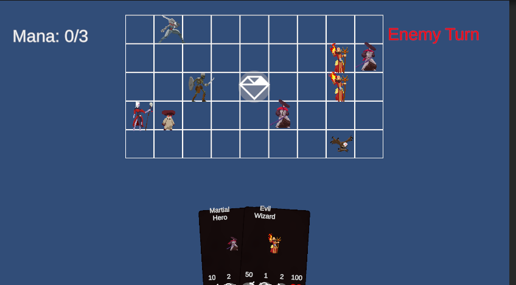

# Tactical Flag Deck 

This project is aiming to be a multiplayer, card-based strategy game. Right now, the game design is still in the early stages—it’s not super fun yet! I’m developing the game in Unity, using free assets found online for models and animations. Networking on the client side is handled using Unity’s **com.unity.transport** package, and the backend is powered by a **Node.js** server. You can check out the backend here: [link](https://github.com/mertcoskunn/TacticalFlagDeck-BackEnd). 

## How to Play and Test

You can test the game using this [link](web-matchserver.up.railway.app). Just open it in two tabs or in two different browsers. The goal of the game is to grab the diamond in the middle and bring it to the rightmost column. Not the best game mechanic out there, but it works for testing!

## To Do

- [x] Extract the server module from the main build and deploy it to a public hosting environment
- [x] Add a game lobby system for multiplayer sessions  
- [ ] Add AI system for single-player mode
- [x] Implement web-based deployment
- [ ] Improve game design and increase card variety
- [ ] Update models and animations
- [ ] Improve game UI

